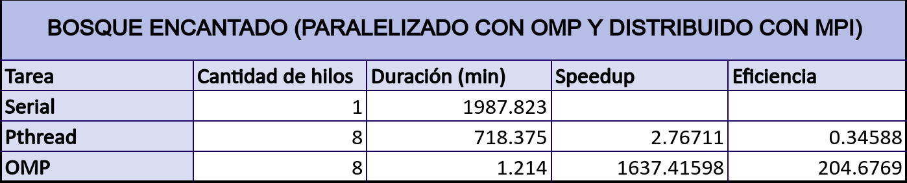
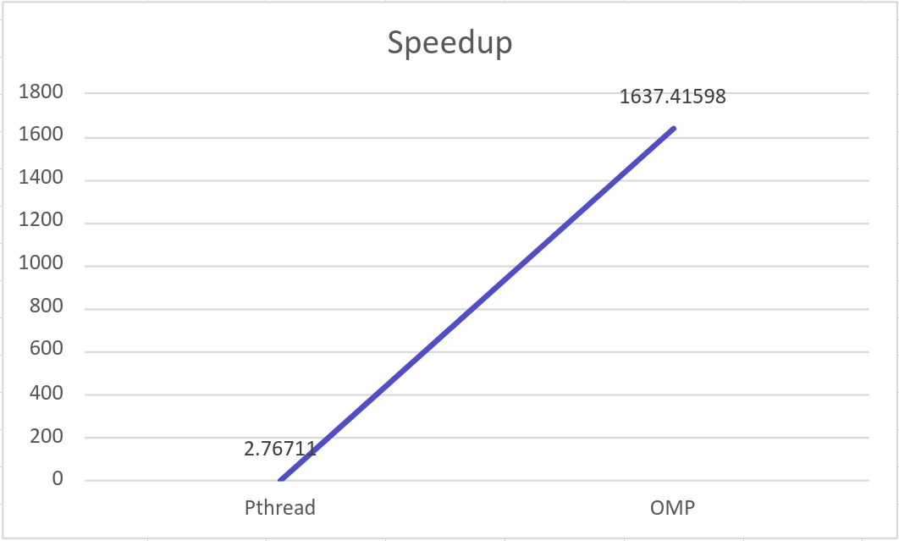
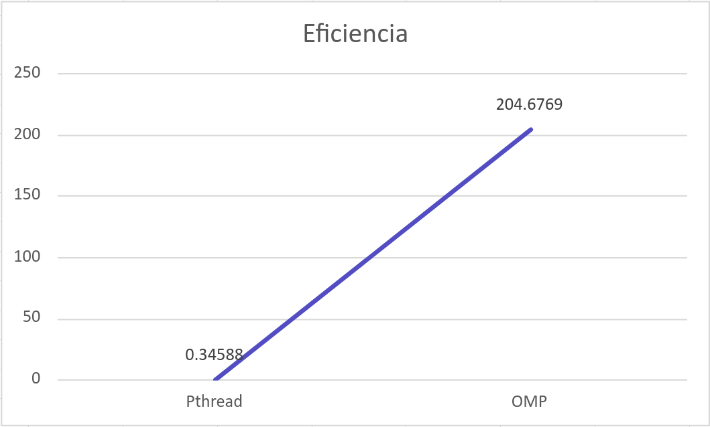
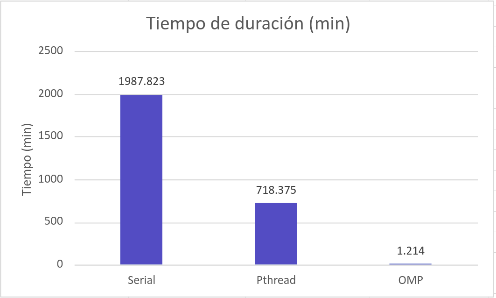

# Universidad de Costa Rica
## Tarea 04
## Goldbach OMP/MPI
### Versión 1.0

## Análisis de rendimiento

Después de desarrollar el programa Pthread y con OMP, se obtienen los tiempos de duración de cada uno, con el objetivo de poder calcular el incremento de velocidad y eficiencia con cada uno de ellos.

Cada uno de los programas se probaron con el input023.txt. Donde para cada uno de ellos se obtuvo el tiempo de duración en **minutos** y se calcula el speedup y eficiencia. Los resultados obtenidos se pueden observar en la siguiente tabla. En la misma se pueden ver los datos obtenidos para la versión Pthread y concurrente OpenMP con 8 hilos. 

A partir de estos resultados, se realizan 2 gráficos de líneas y 1 de barras para representar estos resultados de forma más visual y lograr determinar el rendimiento de cada versión.

Como se puede visualizar, en la figura 1, el speedup de la versión Pthread, fue de 2.76711. Mientras que la concurrente con OMP es de 1637.41598. Por lo que se puede evidenciar que, la versión con OMP es la que obtiene el mejor incremento de velocidad.

En la figura 2, se muestra la eficiencia obtenida a partir de los tiempos de duración cada versión. A partir de estos datos, se puede visualizar que la versión con OMP obtiene la mayor eficiencia. Pues se obtiene, una eficiencia de 0.34588 con la versión de Pthreads, pero una eficiencia de 204.6769 en la de OMP. Esto de debe a varias razones, primero, que para la versión con OMP se utiliza una unidad de descomposición más granular que los números, donde se trabaja de forma concurrente para calcular las sumas de un solo número. Por otro lado, para esta versión se utiliza la optimización 02 de la tarea 04. La cual redujo más de un 90% el tiempo de duración.

Por último, en la figura 3, se realiza una comparación entre los tiempos de duración de cada versión, donde se obtiene el mejor tiempo en la versión con OMP, lo cual afirma en conjunto con los datos de speedup y eficiencia, que esta versión nos da el mejor rendimiendo para el procesamiento de datos a realizar en el programa.

Para concluir, los resultados arrojaron que la versión OMP, cumple con el rendimiento esperado, pues al realizar sus procesos de forma concurrente, aumenta su eficiencia y realiza los procedimientos en un tiempo menor.

## Autor

Hellen Fuentes Artavia, B93082\
