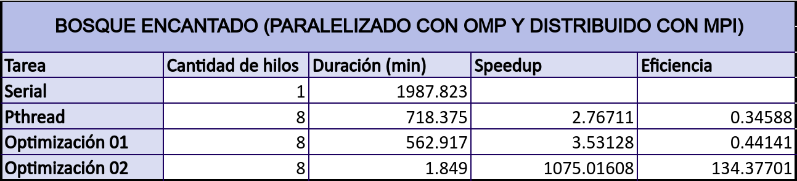
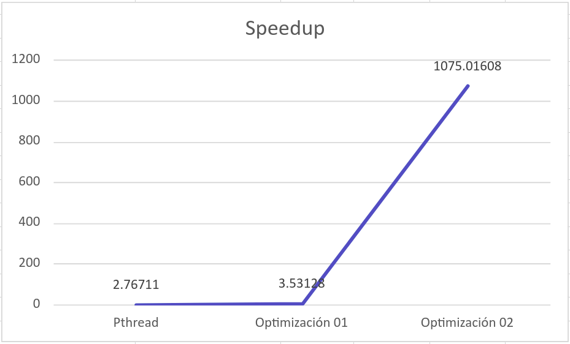
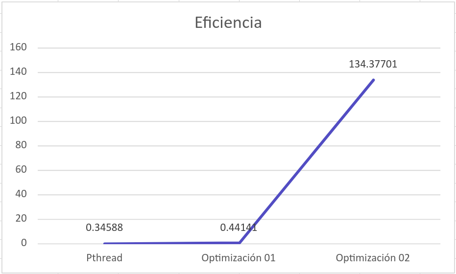
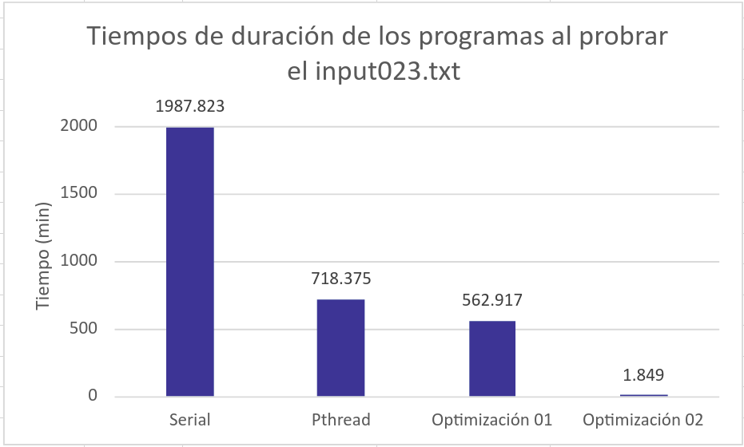

# Universidad de Costa Rica
## Tarea 03
## Goldbach Optimization
### Versión 1.0

## Análisis de rendimiento según optimizaciones

Después de desarrollar las optimizaciones 01 y 02, se obtienen los tiempos de duración de cada una, en conjunto con el programa serial y programa Pthread. Esto con el objetivo de poder calcular el incremento de velocidad y eficiencia con cada uno de ellos y analizar el rendimiento de cada una de las optimizaciones.

Cada uno de los programas se probaron con el input023.txt. Donde para cada uno de ellos se obtuvo el tiempo de duración en **minutos** y se calcula el speedup y eficiencia. Los resultados obtenidos se pueden observar en la siguiente tabla. En la misma se pueden ver los datos obtenidos para las versiones Serial (1 hilo), Pthread, optimizaciones 01 y 02 con 8 hilos.

A partir de estos resultados, se realizan 2 gráficos de líneas y 1 de barras para representar estos resultados de forma más visual y lograr determinar el rendimiento de cada versión.

Como se puede visualizar, en la figura 1, el speedup de la versión Pthread, fue de 2.76711. Mientras que la optimización 01 es de 3.53128. Sin embargo, la optimización 02, alcanza un speedup de 1075.01608. Por lo que se puede evidenciar que, la versión de la segunda optimización es la que obtiene el mejor incremento de velocidad.

En la figura 2, se muestra la eficiencia obtenida a partir de los tiempos de duración de cada versión. A partir de estos datos, se puede visualizar que la versión con la segunda optimización obtiene la mayor eficiencia. Pues se obtiene, una eficiencia de 134.37701, mientras que en la versión de Pthreads la eficiencia es de 0.34588 y en la optimización 01 es de 0.44141. Esto de debe a que, para la versión de optimización 02, se cambia el método del cáculo de los números primos para cada una de las sumas, el cual redujo más de un 90% el tiempo de duración.

Por último, en la figura 3, se realiza una comparación entre los tiempos de duración de cada versión, donde se obtiene el mejor tiempo en la versión de la optimización 02, lo cual afirma, en conjunto con los datos de speedup y eficiencia, que esta versión nos da el mejor rendimiendo para el procesamiento de datos a realizar en el programa.

Para concluir, los resultados arrojaron que la versión Optimización02, cumple con el rendimiento esperado, pues al realizar sus procesos de forma concurrente y con más eficacia para cada número primo de las sumas, aumenta su eficiencia y realiza los procedimientos en un menor tiempo.

## Autor

Hellen Fuentes Artavia, B93082
