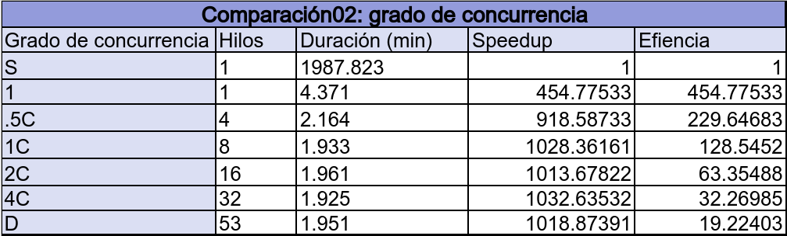
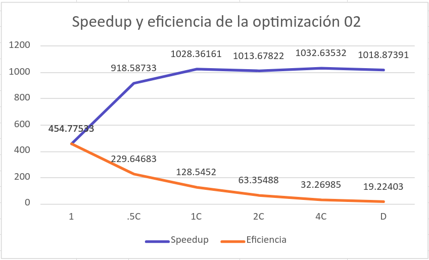

# Universidad de Costa Rica
## Tarea 03
## Goldbach Optimization
### Versión 1.0

## Análisis de rendimiento según grado de concurrencia 

Para llevar a cabo la comparación 02, se compara el tiempo de duración del programa serial y de la optimización 02 en varios niveles distintos de concurrencia. Asimismo, se busca calcular el incremento de velocidad y eficiencia con cada uno de los grados de concurrencia y analizar el rendimiento de cada una de los mismos. Es importante mencionar que, el nivel de concurrencia 1 corresponde a 1 hilo, .5C a 4 hilos, 1C a 8 hilos, 2C a 16 hilos, 4C a 32 hilos y D tiene tantos hilos como números a probar. 

Cada uno de los grados de concurrencia se probaron con el input023.txt. Donde para cada uno de ellos se obtuvo el tiempo de duración en **minutos** y se calcula el speedup y eficiencia. Los resultados obtenidos se pueden observar en la siguiente tabla.

En la tabla anterior, se pueden ver los datos obtenidos para las versión Serial y los distintos niveles de concurrencia.

Como se puede observar, mientras se aumenta el grado de concurrencia, así tambien aumenta el speedup, sin embargo, el mismo se vuelve casi constante despues del nivel de concurrencia 1C. Por otro lado, la eficiencia baja gradualmente según aumenta el grado de concurrencia. Esto mismo se puede visualizar mejor en el siguiente gráfico.

En el gráfico aterior, se puede ver de forma más ilustrativa lo mencionado anteriormente. La línea azul, hace referencia al speedup para cada nivel de concurrencia, donde se ve un incremento significativo en los niveles 1, .5C y 1C, pero se vuelve constrante después de eso. Asimismo, la línea naranja, corresponde a la eficiencia obtenida para cada grado de concurrencia, haciendo énfasis en que, en cuanto aumenta el nivel de concurrencia, disminuye la eficiencia.

Para concluir, lo anterior mencionado, se debe a que, en la máquina donde fue probado el programa de la optimización 02, posee 8 cores. Ṕor lo que, la cantidad máxima de hilos trabajando de forma simultánea es igual a 8. Si se colocan una mayor cantidad de hilos, solo trabajaran 8 a la vez, y habrá una cola de hilos esperando a que otro termine para poder tomar un número y realizar los cálculos. Y es por esto, que el speedup se vuelve constante a partir del grado de concurrencia C1, el cual corresponde a 8 hilos. Y de igual forma, es la razón por la que la eficiencia disminuye a la hora de agregarle más y más hilos sobre 8.